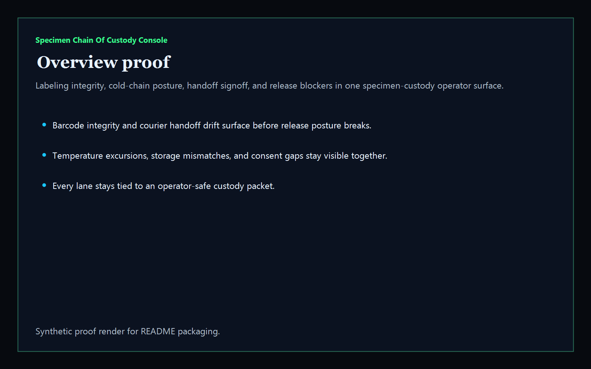
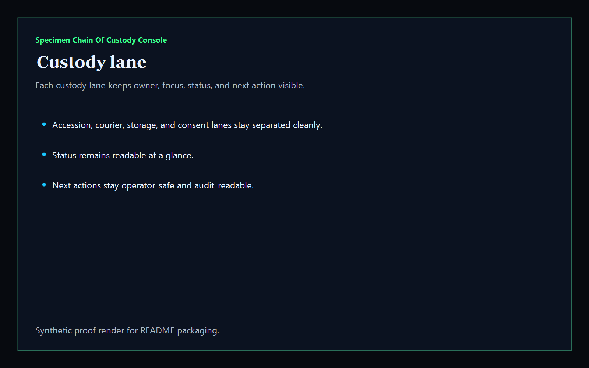
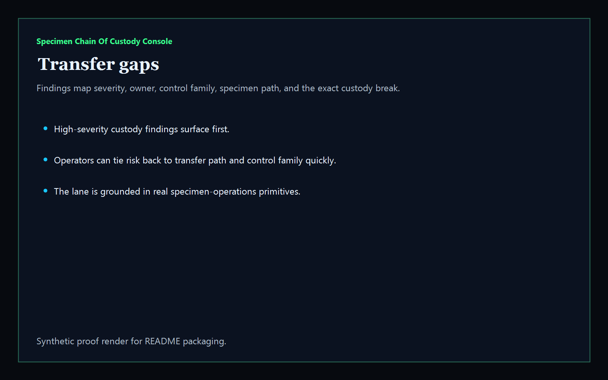
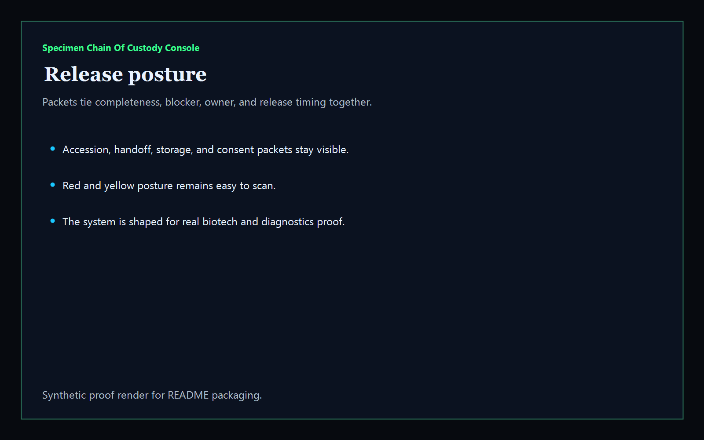

# Specimen Chain Of Custody Console

[](https://github.com/mizcausevic-dev/specimen-chain-of-custody-console/actions/workflows/ci.yml)
[](https://github.com/mizcausevic-dev/specimen-chain-of-custody-console/actions/workflows/pages.yml)

Operator control plane for biotech and diagnostics specimen custody, labeling integrity, cold-chain posture, handoff continuity, and release-safe remediation.

## What it does

- custody-lane visibility for accession, courier, storage, and consent operators
- offline-safe analysis of synthetic specimen-custody snapshot packets
- buyer-readable release posture for lab operations, pathology logistics, and quality stakeholders
- public routes:
  - `/`
  - `/custody-lane`
  - `/transfer-gaps`
  - `/release-posture`
  - `/verification`
  - `/docs`
- structured API routes:
  - `/api/dashboard/summary`
  - `/api/custody-lane`
  - `/api/transfer-gaps`
  - `/api/release-posture`
  - `/api/verification`
  - `/api/sample`

## Screenshots






## CLI

```powershell
npx specimen-chain-of-custody-console .\fixtures\specimen-chain-of-custody.json --format markdown
```

## Local run

```powershell
cd specimen-chain-of-custody-console
npm install
npm run verify
npm run prerender
npm run render:assets
npm run start
```

Then open:

- [http://127.0.0.1:5522/](http://127.0.0.1:5522/)
- [http://127.0.0.1:5522/custody-lane](http://127.0.0.1:5522/custody-lane)
- [http://127.0.0.1:5522/transfer-gaps](http://127.0.0.1:5522/transfer-gaps)
- [http://127.0.0.1:5522/release-posture](http://127.0.0.1:5522/release-posture)

## Live surface

- [https://specimen.kineticgain.com/](https://specimen.kineticgain.com/)

This repo publishes synthetic specimen-custody data only. It does not ship live specimen identifiers, patient information, or laboratory credentials.
